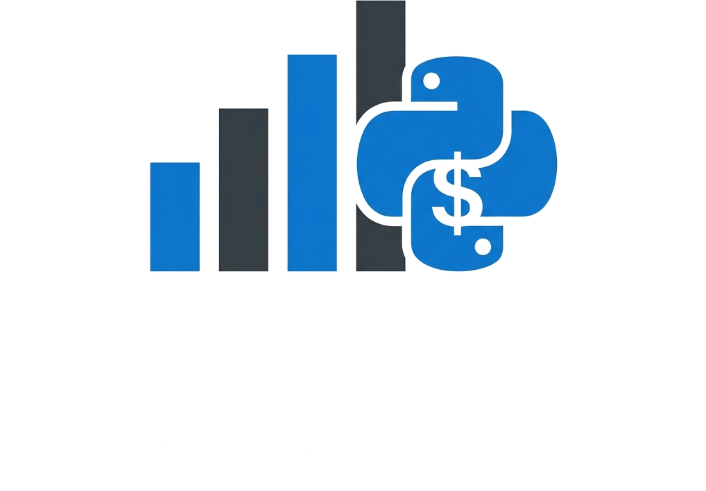

<div align="center">
  
  <h1>ContabiliPy 🚀</h1>
  <p><em>Plataforma SaaS de Automação Contábil e Data Science</em></p>
</div>

Bem-vindo ao **ContabiliPy**, uma solução completa desenvolvida para transformar rotinas contábeis utilizando Inteligência Artificial, Machine Learning e automações avançadas em Python.

## 🎯 Funcionalidades Principais

- **🤖 Agente de IA (ContAi):** Um assistente inteligente (via framework `agno` + Google Gemini) com capacidade de *Function Calling*. Ele entende suas intenções, converte arquivos em lote e extrai estatísticas matemáticas avançadas de suas planilhas usando consultas dinâmicas e respondendo em linguagem natural.
- **🎲 IA Preditiva (Machine Learning):** Módulo avançado de Data Science alimentado pelo `scikit-learn`:
  - **Regressão e Classificação:** Treine modelos (ex: Random Forest) em tempo real para simular análises de crédito, estimativas de custos ou previsão de vendas.
  - **Séries Temporais:** Projete o faturamento futuro do seu negócio gerando gráficos preditivos interativos baseados no seu histórico.
- **📂 Manipulação Avançada de Dados:** Uma suíte completa baseada na força do Pandas:
  - 🔄 **Conversões:** Transição livre entre Excel (.xlsx), CSV, JSON e HTML.
  - 📥 **Extrações:** Oculte colunas e aplique filtros matemáticos e lógicos dinâmicos.
  - 🔗 **Junções:** Realize operações complexas de `Merge` (PROCV inteligente) e `Concat` (Empilhamento).
  - 📊 **Dashboards Interativos:** Geração automática de gráficos com a biblioteca `Plotly` (Barras, Linhas, Pizza, Área, Histograma e Dispersão), permitindo zoom e exportação de imagens.
  - 📄 **Relatórios (Laudos Técnicos):** Auditoria rápida gerando resumos em `.txt` sobre tipos de dados, contagens e valores nulos.
- **ℹ️ Central de Ajuda Contextual:** Modais integrados (estilo *React Props* via `st.dialog`) espalhados por todo o sistema para facilitar a curva de aprendizado de usuários novos.

## 🛠️ Tecnologias Utilizadas

- **[Python](https://www.python.org/)** - Engine de processamento principal.
- **[Streamlit](https://streamlit.io/)** - Construção de toda a interface web reativa.
- **[Pandas](https://pandas.pydata.org/)** - Engenharia de dados e ETL.
- **[Scikit-Learn](https://scikit-learn.org/)** - Modelagem preditiva de Machine Learning.
- **[Plotly](https://plotly.com/)** - Gráficos e Dashboards responsivos.
- **[Agno](https://github.com/agno-ai/agno) & Google Gemini** - Orquestração e criação do Agente de Inteligência Artificial.
- **Docker** - Conteinerização de ambientes.

## ⚙️ Pré-requisitos

Para rodar o projeto localmente, certifique-se de ter o Python (3.10+) instalado. Você também precisará configurar suas credenciais da API do Google Gemini.

1. Crie uma pasta oculta `.streamlit` na raiz do projeto.
2. Dentro dela, crie um arquivo chamado `secrets.toml`.
3. Adicione sua chave de API:
```toml
GOOGLE_API_KEY = "sua-chave-api-aqui"
```

## 🚀 Como Executar

Você pode executar o projeto de duas formas: nativamente usando Python ou via Docker.

### Opção 1: Usando Python (Virtual Environment)

1. Clone o repositório.
2. Crie um ambiente virtual:
   ```bash
   python -m venv venv
   ```
3. Ative o ambiente virtual:
   - **Windows:** `venv\Scripts\activate`
   - **Linux/Mac:** `source venv/bin/activate`
4. Instale as dependências:
   ```bash
   pip install -r requirements.txt
   ```
5. Rode a aplicação:
   ```bash
   streamlit run app.py
   ```

### Opção 2: Usando Docker

1. Certifique-se de que o Docker e o Docker Compose estão instalados e rodando.
2. Execute o comando:
   ```bash
   docker-compose up --build
   ```
3. Acesse a aplicação no seu navegador: `http://localhost:8501`.

## 📂 Estrutura do Projeto

- `/agent` - Cérebro do projeto. Contém a configuração, tools e instruções do agente ContAi (`agno`).
- `/components` - Módulos de interface reutilizáveis (Dashboards, Junções, Sidebar, Modais de Ajuda, Previsão IA).
- `/pages` - Telas de navegação do Streamlit.
- `/tools` - Scripts utilitários "burros" para manipulação de arquivos consumidos pelo Agente.
- `app.py` - Ponto de entrada (Home).
- `requirements.txt` - Arquivo oficial com as dependências master (otimizado para nuvem/Linux).

## 👨‍💻 Desenvolvedor
Desenvolvido por **Guilherme Sampaio**  
[LinkedIn](https://www.linkedin.com/in/guilhermessampaio)
